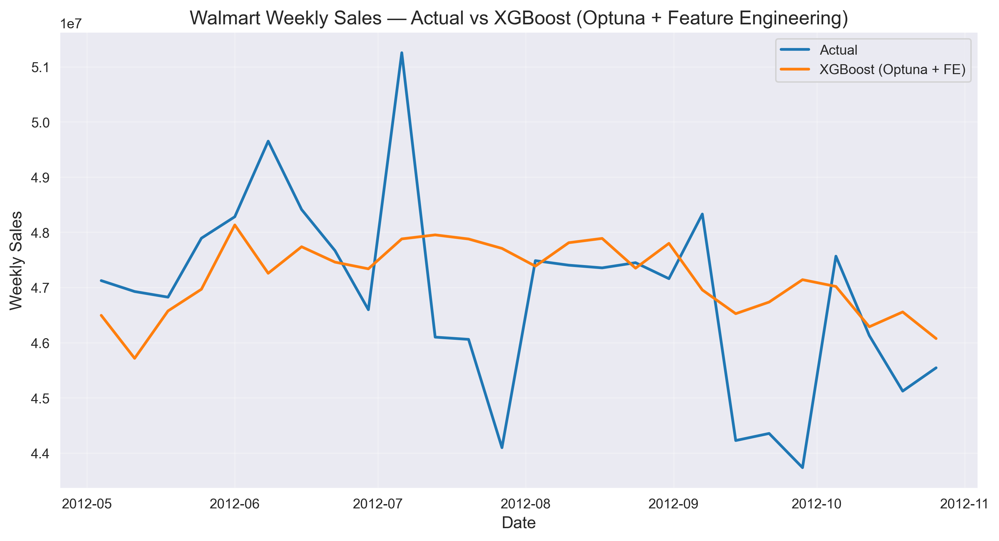
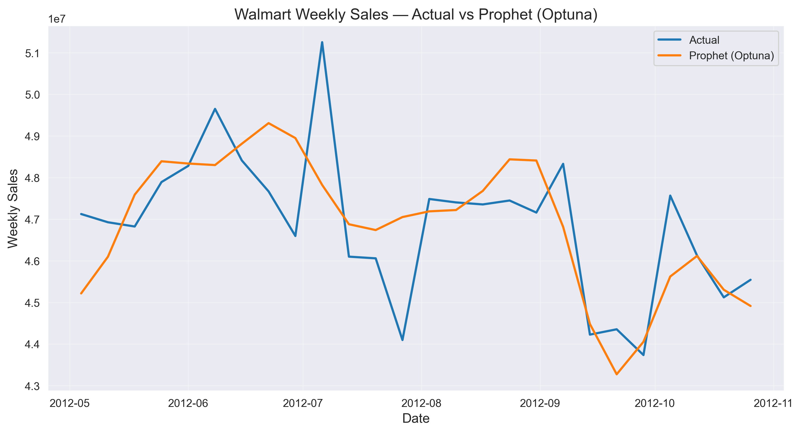
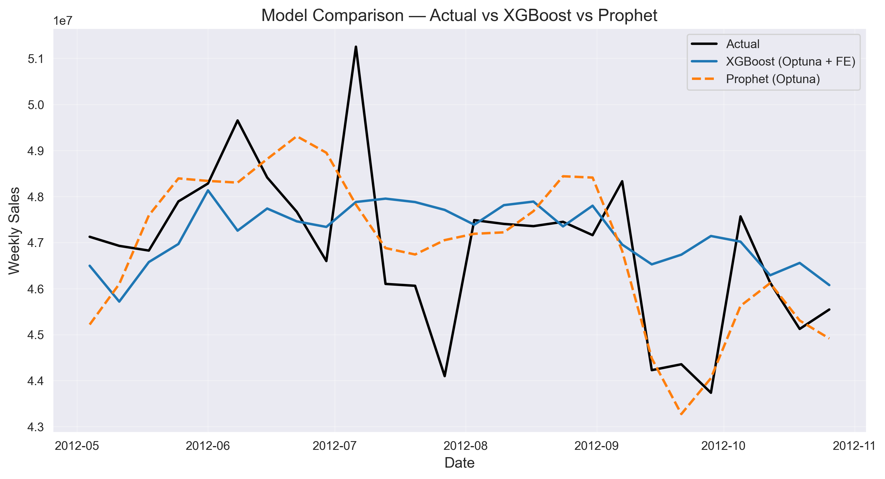
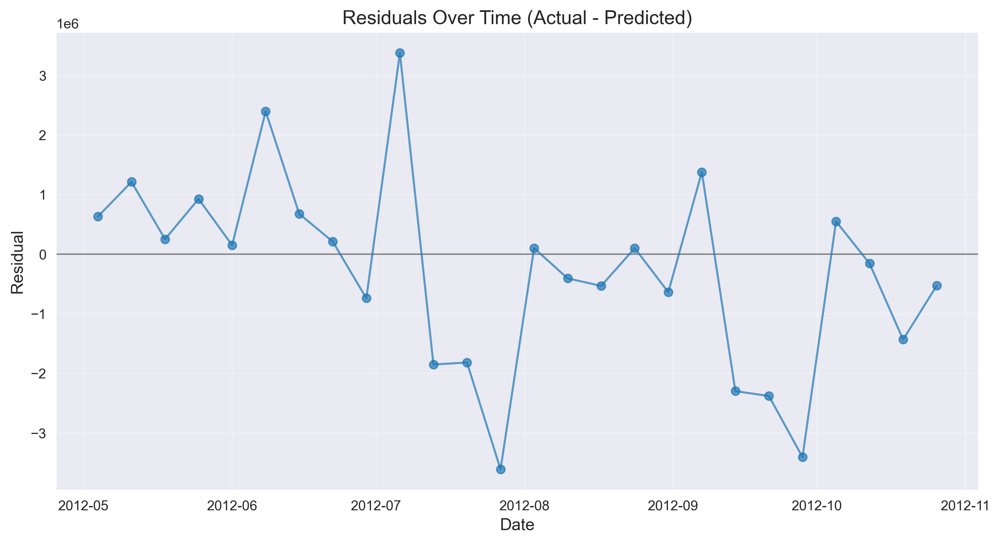
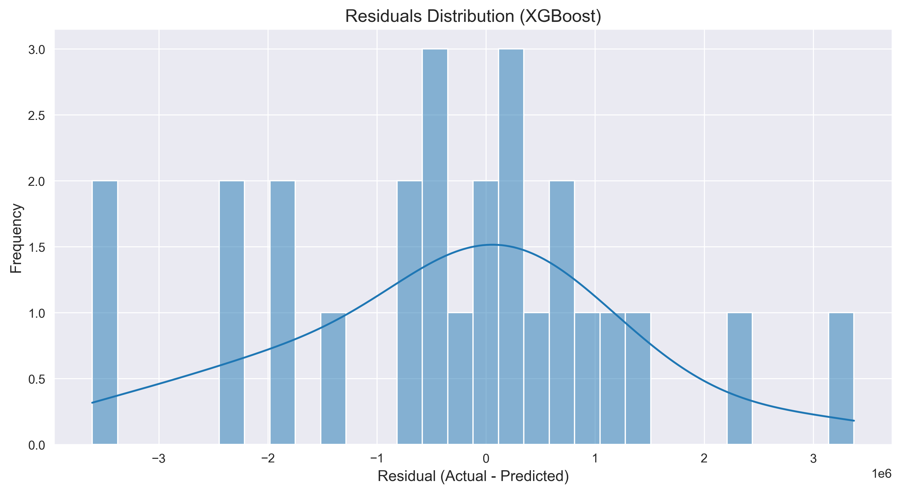
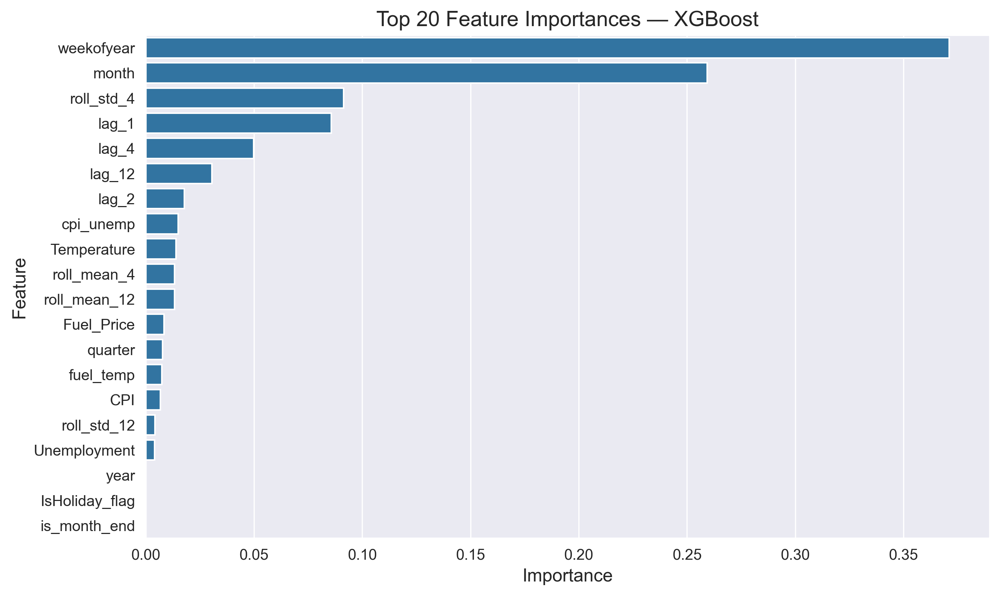
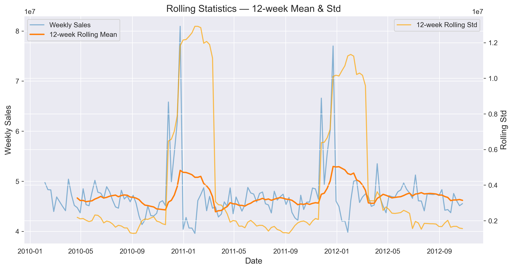
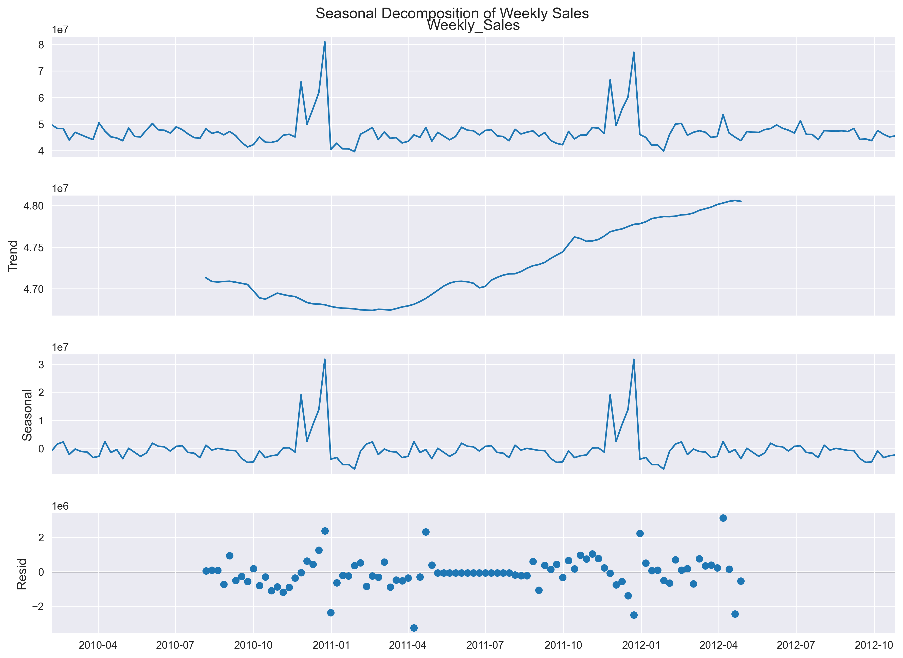
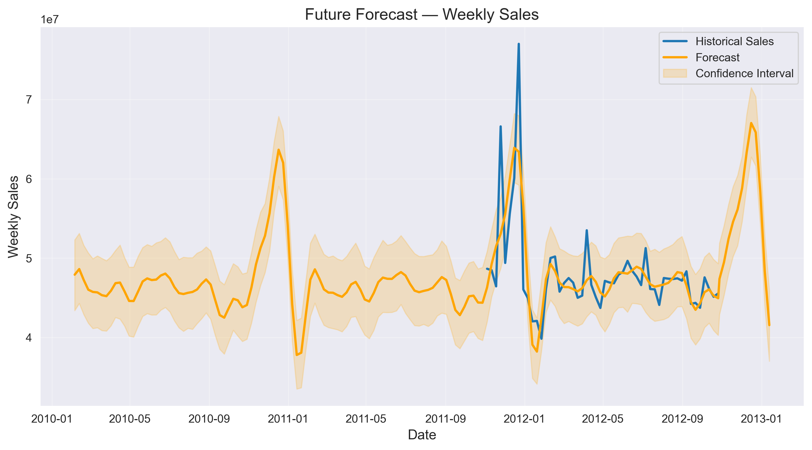

# Walmart Sales Forecasting — End-to-End ML + BI Pipeline

[](https://skayy47-walmart-sales-forecasting.streamlit.app)


> **Best model: Prophet (Optuna-tuned) — MAPE 2.17% | RMSE $1.35M**

A production-grade time-series forecasting system for Walmart's weekly store sales, combining classical and ML models with Bayesian hyperparameter optimization and a full Power BI business intelligence dashboard.

---

## Table of Contents

- [Overview](#overview)
- [Results](#results)
- [Dashboard Gallery](#dashboard-gallery)
- [Project Structure](#project-structure)
- [Methodology](#methodology)
- [Quick Start](#quick-start)
- [Data](#data)
- [Power BI Integration](#power-bi-integration)
- [Skills Used](#skills-collected)

---

## Overview

This project tackles the [Walmart Store Sales Forecasting](https://www.kaggle.com/competitions/walmart-recruiting-store-sales-forecasting) challenge end-to-end:

- **Data pipeline**: merge & clean 3 raw CSVs (sales, features, stores) into a weekly time series
- **Feature engineering**: lag features, rolling statistics, calendar encodings, interaction terms
- **Model benchmark**: XGBoost, Prophet + regressors, SARIMAX — all compared on a held-out test set
- **Hyperparameter optimization**: Optuna with TimeSeriesSplit cross-validation
- **Analytics dashboard**: 9 automated charts (Matplotlib + Seaborn) — auto-saved as high-res PNGs
- **Power BI integration**: clean CSV exports ready to connect directly to a Power BI report

---

## Results

| Model | MAE | RMSE | MAPE |
|---|---|---|---|
| **Prophet (Optuna-tuned)** | **$1,024,014** | **$1,352,138** | **2.17%** |
| XGBoost (Optuna + FE) | $1,378,265 | $1,884,462 | — |
| XGBoost (baseline) | $1,221,143 | $1,625,766 | 2.63% |
| Prophet + Regressors | $2,300,821 | $2,748,733 | 4.95% |
| SARIMAX | $3,298,372 | $3,629,445 | 7.09% |

> Evaluation window: May 2012 – October 2012 (20% holdout, temporal split — no data leakage).

**Key findings:**
- Seasonality dominates (`weekofyear` + `month` = top 2 features)
- Prophet with Optuna-tuned `changepoint_prior_scale` outperforms XGBoost on this dataset
- Short-term lag (`lag_1`) and rolling volatility (`roll_std_4`) add meaningful signal to tree models
- SARIMAX struggles without sufficient seasonal history at 52-week period

---

## Dashboard Gallery

All charts are auto-generated by `02_ml_forecasting.ipynb` and saved to `outputs/dashboard_images/`.

### Actual vs XGBoost (Optuna + Feature Engineering)


### Actual vs Prophet (Optuna-Tuned)


### Model Comparison — Actual vs XGBoost vs Prophet


### Residuals Over Time


### Residual Distribution


### Top 20 Feature Importances (XGBoost)


### Rolling Statistics — 12-Week Mean & Std


### Seasonal Decomposition


### Future Forecast


---

## Project Structure

```
walmart-sales-forecasting/
├── notebooks/
│   ├── 01_data_cleaning.ipynb      # ETL pipeline: load → merge → clean → export
│   └── 02_ml_forecasting.ipynb     # ML models, Optuna tuning, dashboard generation
├── outputs/
│   ├── dashboard_images/           # 9 high-res PNG charts (auto-generated)
│   └── powerbi_exports/            # CSVs ready for Power BI connection
│       ├── powerbi_clean_walmart.csv
│       ├── powerbi_xgb_predictions.csv
│       ├── powerbi_prophet_predictions.csv
│       └── powerbi_future_forecast.csv
├── data/                           # Put raw Kaggle CSVs here (gitignored)
│   ├── train.csv
│   ├── features.csv
│   └── stores.csv
├── .gitignore
├── requirements.txt
└── README.md
```

---

## Methodology

### 1. Data Pipeline (`01_data_cleaning.ipynb`)

```
train.csv + features.csv + stores.csv
        ↓  merge on [Store, Date]
        ↓  drop Weekly_Sales < 0
        ↓  fill numeric NaNs with median
        ↓  aggregate to global weekly series
        →  clean_walmart.csv
```

### 2. Feature Engineering

| Category | Features |
|---|---|
| Calendar | `weekofyear`, `month`, `quarter`, `year`, `is_year_start/end`, `is_month_start/end` |
| Lag | `lag_1`, `lag_2`, `lag_4`, `lag_12` (1wk → ~1 quarter) |
| Rolling | `roll_mean_4/12`, `roll_std_4/12` (shifted to prevent leakage) |
| Macroeconomic | `Temperature`, `Fuel_Price`, `CPI`, `Unemployment` |
| Interaction | `fuel_temp`, `cpi_unemp`, `lag_1_holiday` |

### 3. Models

**XGBoost** — gradient-boosted trees on the full feature matrix with `TimeSeriesSplit` CV.

**Prophet** — Facebook's decomposable time-series model with additive/multiplicative seasonality and optional external regressors. Tuned with Optuna (`changepoint_prior_scale`, `seasonality_prior_scale`, `seasonality_mode`).

**SARIMAX** — seasonal ARIMA with exogenous variables. Baseline only (weekly 52-period seasonality is data-hungry).

### 4. Hyperparameter Optimization (Optuna)

Both XGBoost and Prophet are tuned via **30-trial Bayesian optimization** (Tree-structured Parzen Estimator). XGBoost uses a `TimeSeriesSplit(n_splits=4)` inner CV to prevent temporal leakage.

```python
study = optuna.create_study(direction="minimize")
study.optimize(objective, n_trials=30)
```

---

## Live Demo

The app is deployed on Streamlit Cloud — **no install required**:

👉 **[walmart-sales-forecasting.streamlit.app](https://skayy47-walmart-sales-forecasting.streamlit.app)**

Five interactive pages:
- **📊 Overview** — KPI cards, historical sales trend, YoY heatmap
- **🤖 Model Comparison** — Actual vs XGBoost vs Prophet, residual analysis, scatter plot
- **🔮 Forecast** — Future forecast with 95% confidence bands + seasonal components
- **📈 Feature Analysis** — Interactive feature importance, rolling statistics, key insights
- **🖼️ Gallery** — All 9 high-res dashboard charts

---

## Quick Start

```bash
# 1. Clone
git clone https://github.com/skayy47/walmart-sales-forecasting.git
cd walmart-sales-forecasting

# 2. Install dependencies
pip install -r requirements.txt

# 3. Add raw data (download from Kaggle)
#    https://www.kaggle.com/competitions/walmart-recruiting-store-sales-forecasting/data
#    Place train.csv, features.csv, stores.csv in data/

# 4. Run notebooks in order
jupyter lab
# → notebooks/01_data_cleaning.ipynb
# → notebooks/02_ml_forecasting.ipynb

# 5. Launch the Streamlit dashboard locally
streamlit run app.py
```

> All outputs (dashboard PNGs + Power BI CSVs) are regenerated automatically.

---

## Data

Data comes from the [Walmart Store Sales Forecasting](https://www.kaggle.com/competitions/walmart-recruiting-store-sales-forecasting) Kaggle competition.

| File | Rows | Description |
|---|---|---|
| `train.csv` | 421,570 | Weekly sales per store × department |
| `features.csv` | 8,190 | Macroeconomic indicators + markdowns |
| `stores.csv` | 45 | Store type (A/B/C) and square footage |

Raw files are **gitignored** (12MB+ total). Download them from Kaggle and place in `data/`.

---

## Power BI Integration

The `outputs/powerbi_exports/` folder contains four CSVs that map directly to Power BI tables:

| CSV | Power BI Use |
|---|---|
| `powerbi_clean_walmart.csv` | Historical sales trend, KPIs |
| `powerbi_xgb_predictions.csv` | Actual vs Predicted (XGBoost) visual |
| `powerbi_prophet_predictions.csv` | Actual vs Predicted (Prophet) visual |
| `powerbi_future_forecast.csv` | Forward-looking forecast card |

Connect via **Get Data → Text/CSV** in Power BI Desktop. The `.pbix` dashboard file is included in the repo root.

---

## Skills Collected

| Tool | Role |
|---|---|
| `pandas` / `numpy` | ETL, feature engineering |
| `prophet` | Seasonal decomposition + forecasting |
| `xgboost` | Gradient-boosted regression |
| `statsmodels` | SARIMAX baseline + seasonal decomposition |
| `optuna` | Bayesian hyperparameter tuning (30 trials each) |
| `matplotlib` / `seaborn` | 9-chart analytics dashboard |
| Power BI | Business intelligence dashboard (`.pbix`) |

---

## Author

**SKAY** — AI Engineer & Data Scientist  
[GitHub](https://github.com/skayy47) · [LinkedIn](https://linkedin.com/in/oussama-iskia)

---

*Built end-to-end: ETL → feature engineering → multi-model benchmark → Optuna tuning → BI dashboard → Power BI export.*
